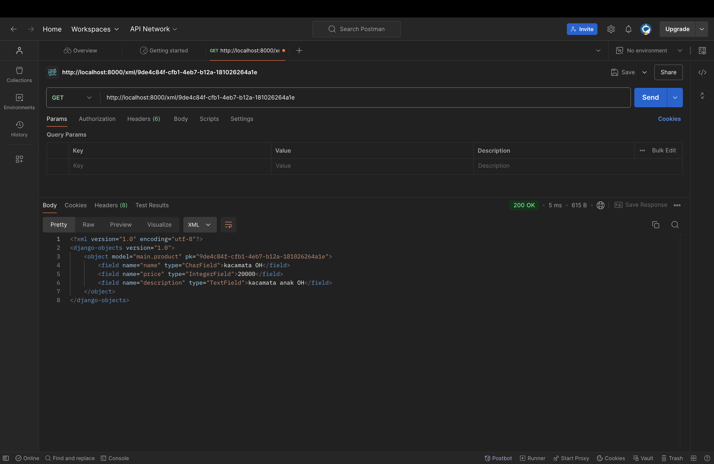

Nama : Anindhyaputri Paramitha

NPM : 2306218111

Kelas : PBP B

e-commerce : tekiee (menjual berbagai jenis kacamata)

http://anindhyaputri-paramitha-tekiee.pbp.cs.ui.ac.id/

### TUGAS 2

I. Jelaskan bagaimana cara kamu mengimplementasikan checklist di atas secara step-by-step (bukan hanya sekadar mengikuti tutorial).

### Inisiasi Direktori Lokal dan GitHub
1. Buat repositori baru di GitHub dengan nama “tekiee”.
2. Buat direktori lokal bernama "tekie" untuk menyimpan proyek git.
3. Inisiasi repositori baru dengan perintah `git init`.
4. Konfigurasi nama pengguna dan email dengan perintah `git config --global user.name "Nama Anda"` dan `git config --global user.email "email@domain.com"`.
5. Lakukan autentikasi git (`git credential-manager configure` dan `git config --global credential.credentialStore keychain`)
6. Verifikasi konfigurasi dengan `git config --list`.
7. Dalam direktori lokal "tekie", buat berkas baru bernama `README.md` 
8. Tambahkan dan commit berkas tersebut dengan perintah `git add README.md` diikuti `git commit -m "Initial commit"`.
9. Buat branch utama bernama "main" dengan `git branch -M main`.
10. Hubungkan repositori lokal ke repositori GitHub menggunakan `git remote add origin <URL_REPO>`.
11. Push perubahan ke GitHub dengan `git push -u origin main`.
12. Verifikasi apakah repositori GitHub telah berhasil di-update.

### Pembuatan dan Pengelolaan Branch
1. Buat dan beralih ke branch baru dengan perintah `git checkout -b <NAMA_BRANCH>`.
2. Lakukan perubahan, tambahkan, commit, dan push ke branch baru dengan `git add`, `git commit`, dan `git push -u origin <NAMA_BRANCH>`.
3. Di GitHub, lakukan merge pull request untuk menggabungkan branch baru ke branch utama (main).

### Inisiasi Proyek Django
1. Buat virtual environment dan aktifkan (akan terbentuk subdirektori `env` setelah diaktifkan).
2. Siapkan dependencies dan buat proyek Django. Buat berkas `requirements.txt`, install dependencies, dan buat proyek Django dengan `django-admin startproject`.
3. Setelah itu, di dalam direktori lokal "tekie", akan terbentuk beberapa berkas dan subdirektori seperti `manage.py`, `requirements.txt`, dan subdirektori proyek Django dengan nama `tekie`.
4. Edit `ALLOWED_HOSTS` di berkas `settings.py` untuk menentukan siapa yang bisa mengakses aplikasi.
5. Jalankan server Django dengan perintah `python manage.py runserver` dan buka http://localhost:8000 untuk melihat halaman Django default.
6. Untuk menghentikan server, tekan `Ctrl+C` dan nonaktifkan virtual environment.

### Unggah Proyek ke GitHub
1. Buat berkas `.gitignore` dan isi dengan daftar berkas atau direktori yang tidak perlu dilacak oleh Git, seperti file sementara atau konfigurasi pribadi.
2. Lakukan `git add`, `git commit`, dan `git push` untuk mengunggah perubahan ke GitHub.

### Pembuatan Aplikasi Django dan Konfigurasi Model
1. Aktifkan virtual environment.
2. Buat aplikasi baru bernama "main" (direktori "main" akan terbentuk dengan struktur awal aplikasi Django).
3. Daftarkan aplikasi "main" ke dalam proyek dengan menambahkannya di variabel `INSTALLED_APPS` di `settings.py`.
4. Buat berkas template `main.html` di dalam direktori `templates` di aplikasi "main" dan isi sesuai kebutuhan.
5. Buka berkas `models.py` dan tambahkan model `Product` sesuai tugas, berisi atribut `name`, `price`, dan `description`.
6. Lakukan migrasi untuk menyimpan perubahan pada model (migrasi ini akan terus dilakukan setiap mengubah models).
7. Hubungkan view dengan template, buat fungsi `show_main` di `views.py` dan sertakan data yang ingin ditampilkan.
8. Tambahkan data di `views.py` karena pada tahap ini data masih boleh disimpan di views sesuai arahan asisten dosen.
9. Modifikasi template HTML sesuai preferensi.
10. Atur routing URL di `urls.py` aplikasi "main" agar fungsi `show_main` bisa diakses melalui browser.
11. Konfigurasikan routing URL proyek di `urls.py` direktori proyek, bukan yang ada di dalam direktori aplikasi main.
12. Jalankan server Django dan buka http://localhost:8000 untuk memverifikasi halaman.

### Unit Testing
1. Buka berkas `tests.py` di aplikasi "main" dan tambahkan fungsi untuk unittest.
2. Jalankan tes untuk memastikan kode berfungsi dengan benar.

### Deployment ke PWS (Pacil Web Service)
1. Akses halaman PWS, login, dan buat proyek baru.
2. Tambahkan URL deployment PWS ke dalam `ALLOWED_HOSTS` di `settings.py`.
3. Lakukan `git add`, `commit`, dan `push` untuk mengunggah perubahan ke GitHub.
4. Jalankan perintah yang disediakan di halaman proyek PWS.
5. Jika ada perubahan di masa depan, cukup jalankan `git push pws main:master` setelah melakukan `add` dan `commit`.

II. Buatlah bagan yang berisi request client ke web aplikasi berbasis Django beserta responnya dan jelaskan pada bagan tersebut kaitan antara urls.py, views.py, models.py, dan berkas html.

### Alur Request-Response Django
### Request dari Client: 
Pengguna mengirim permintaan (request) melalui browser dengan mengakses URL aplikasi web (misalnya, http://localhost:8000/main).

### urls.py: 
Django pertama kali memproses request melalui urls.py. Berkas ini berfungsi sebagai penghubung antara URL yang diakses pengguna dengan fungsi yang sesuai di views.py. Jika URL cocok dengan pola yang didefinisikan, Django akan meneruskannya ke fungsi yang terdaftar di views.py.

### views.py: 
Di dalam views.py, fungsi yang sesuai (misalnya, show_main) akan dijalankan. Fungsi ini bertanggung jawab untuk mengambil data (baik dari models.py maupun data yang dimasukkan langsung di views.py) dan kemudian mengembalikannya dalam bentuk response.

### models.py: 
Jika fungsi di views.py membutuhkan data dari database, ia akan melakukan query melalui model yang didefinisikan di models.py. Contohnya, jika aplikasi perlu menampilkan daftar produk, fungsi akan mengakses model Product untuk mengambil data yang dibutuhkan.

### HTML Template: 
Setelah data diambil (baik dari views.py maupun models.py), data tersebut akan diteruskan ke berkas HTML (misalnya, main.html). Template HTML ini mengatur bagaimana data ditampilkan kepada pengguna.

### Response: 
Django akan mengirimkan hasil dari template HTML yang sudah diisi data sebagai response ke browser. Browser kemudian menampilkan halaman web kepada pengguna.

### Bagan Request-Response Django

### Kaitan Antara urls.py, views.py, models.py, dan HTML Template
### urls.py: 
Menghubungkan URL dengan fungsi di views.py. Setiap URL di aplikasi web diatur di sini, sehingga ketika pengguna mengakses URL tertentu, Django akan tahu fungsi mana yang harus dipanggil.

### views.py: 
Berisi logika untuk memproses request dari pengguna. Fungsi di views.py dapat mengambil data dari models.py atau langsung mengatur data yang akan ditampilkan ke pengguna. Setelah data siap, views.py akan mengirimkan data ke template HTML untuk dirender.

### models.py: 
Berfungsi untuk berinteraksi dengan database. Jika data perlu diambil atau disimpan ke database, views.py akan memanggil model yang sesuai di models.py. Data yang diambil dari models.py kemudian dikirim ke template HTML melalui views.py.

### HTML Template: 
Berkas HTML yang berfungsi untuk menampilkan data kepada pengguna. Template ini diisi dengan data yang dikirim dari views.py dan di-render untuk menghasilkan halaman web yang bisa diakses oleh pengguna di browser.

III. Jelaskan fungsi git dalam pengembangan perangkat lunak!

Git adalah alat penting dalam pengembangan perangkat lunak yang berfungsi untuk mengelola dan melacak perubahan kode. Dengan Git, pengembang dapat menyimpan berbagai versi kode yang disebut *commit*, sehingga setiap perubahan dapat dipantau, dibandingkan, atau dikembalikan ke versi sebelumnya jika diperlukan. Git juga memudahkan kolaborasi antar anggota tim, di mana setiap orang bisa bekerja pada cabang (*branch*) terpisah tanpa mengganggu kode utama, dan hasilnya bisa digabungkan (*merge*) saat sudah siap.

Selain itu, Git juga berguna untuk menyimpan cadangan (*backup*) proyek, sehingga jika terjadi masalah pada komputer lokal, kode tetap aman di repositori GitHub atau server lainnya. Git mencatat setiap perubahan, lengkap dengan siapa yang melakukannya dan kapan, sehingga bisa memudahkan pemantauan dan memecahkan masalah jika ada bug. 

Git juga terintegrasi dengan alat otomatis seperti Continuous Integration (CI) dan Continuous Deployment (CD), yang membantu pengembang menguji dan menerapkan perubahan secara cepat. Dengan kemampuan Git untuk mendeteksi konflik ketika ada dua orang yang mengubah kode yang sama, pengembang bisa menyelesaikan masalah tersebut dengan mudah, menjaga agar proyek tetap berjalan lancar.

IV. Menurut Anda, dari semua framework yang ada, mengapa framework Django dijadikan permulaan pembelajaran pengembangan perangkat lunak?

Django sering dijadikan permulaan dalam pembelajaran pengembangan perangkat lunak karena beberapa alasan utama. Pertama, Django adalah framework yang bersifat *full-stack*, artinya Django sudah menyediakan berbagai fitur penting yang dibutuhkan dalam membangun aplikasi web, seperti manajemen database, routing URL, dan autentikasi, tanpa perlu banyak pengaturan tambahan. Hal ini memudahkan pemula untuk fokus belajar konsep-konsep inti dalam pengembangan web tanpa harus memikirkan terlalu banyak alat atau library eksternal.

Selain itu, Django menggunakan bahasa Python, yang terkenal mudah dipahami karena sintaksnya yang sederhana dan jelas. Python juga sering menjadi bahasa pertama yang dipelajari oleh banyak orang yang baru mulai belajar pemrograman, sehingga menggunakan Django sebagai framework selanjutnya terasa lebih mudah. Django juga memiliki dokumentasi yang sangat lengkap, yang memudahkan pemula untuk mengikuti langkah-langkah pembangunan aplikasi dari awal hingga akhir.

Terakhir, Django mendorong praktik pengembangan yang baik, seperti penggunaan *models-view-template* (MVT), yang mengajarkan bagaimana memisahkan logika bisnis, tampilan, dan data secara rapi. Dengan begitu, Django menjadi pilihan tepat untuk memulai pembelajaran karena memudahkan pemahaman konsep, memberikan alat yang lengkap, dan membantu membangun kebiasaan kode yang terstruktur.

V. Mengapa model pada Django disebut sebagai ORM?

Model pada Django disebut sebagai ORM (Object-Relational Mapping) karena berfungsi sebagai jembatan antara objek dalam kode Python dengan tabel-tabel di database relasional. ORM memungkinkan pengembang untuk berinteraksi dengan database menggunakan konsep objek, tanpa perlu menulis perintah SQL secara langsung. Dengan ORM, setiap model dalam Django merepresentasikan sebuah tabel di database, dan atribut-atribut model tersebut menjadi kolom-kolom dalam tabel.

Misalnya, jika membuat model bernama `Product` dengan atribut `name`, `price`, dan `description`, Django secara otomatis mengubahnya menjadi tabel `Product` di database dengan kolom-kolom yang sesuai. ORM ini memudahkan pengelolaan data dalam aplikasi karena pengembang hanya perlu menggunakan kode Python untuk membuat, membaca, memperbarui, dan menghapus data. Ini membuat pengembangan lebih cepat dan mudah, serta mengurangi kemungkinan kesalahan dalam penulisan SQL.

### TUGAS 3

### Screenshot Postman

### 1. Jelaskan mengapa kita memerlukan data delivery dalam pengimplementasian sebuah platform?

Data delivery penting karena ia memastikan data bisa dikirim dan diterima dengan baik antara server dan pengguna. Ini termasuk informasi yang dibutuhkan untuk menjalankan aplikasi, seperti data dari pengguna atau hasil pencarian. Jika data delivery tidak berfungsi dengan baik, aplikasi bisa lambat, mengalami kesalahan, atau bahkan tidak dapat mengirimkan informasi yang benar. Jadi, data delivery yang efektif membantu aplikasi bekerja dengan lancar dan memberikan pengalaman pengguna yang baik.

### 2. Menurutmu, mana yang lebih baik antara XML dan JSON? Mengapa JSON lebih populer dibandingkan XML?

JSON umumnya dianggap lebih baik daripada XML untuk aplikasi web karena beberapa alasan utama. Pertama, JSON lebih ringkas dan sederhana dibandingkan XML, sehingga lebih mudah dibaca dan dipahami. Kedua, JSON mudah digunakan dalam berbagai bahasa pemrograman, terutama JavaScript, yang sering digunakan dalam pengembangan web. Ketiga, JSON sering lebih efisien, dengan sintaks yang lebih ringkas dan struktur yang lebih sederhana, JSON sering kali lebih cepat dalam hal kecepatan pemrosesan dan lebih hemat ruang penyimpanan. Karena kemudahan dan efisiensinya, JSON menjadi pilihan utama dalam banyak aplikasi web dan API.

JSON lebih populer karena kemudahan dan efisiensinya, yang membuatnya pilihan utama dalam banyak aplikasi web dan API.

### 3. Jelaskan fungsi dari method is_valid() pada form Django dan mengapa kita membutuhkan method tersebut?

Method `is_valid()` di Django digunakan untuk memastikan bahwa data yang dimasukkan ke dalam form sudah benar dan sesuai dengan aturan yang ditetapkan. Fungsi utama dari method ini adalah memeriksa setiap input data untuk memastikan bahwa data tersebut memenuhi semua kriteria validasi yang telah ditentukan, seperti format yang benar, panjang data yang sesuai, dan tidak adanya kesalahan lain. Dengan memanggil `is_valid()`, kita bisa memastikan bahwa hanya data yang valid dan sesuai yang diterima oleh aplikasi, sehingga mengurangi risiko kesalahan atau masalah yang bisa terjadi akibat data yang tidak benar. Method ini sangat penting karena membantu menjaga integritas data yang masuk ke aplikasi, memastikan bahwa aplikasi berfungsi dengan baik dan memberikan pengalaman pengguna yang lebih baik.

### 4. Mengapa kita membutuhkan csrf_token saat membuat form di Django? Apa yang dapat terjadi jika kita tidak menambahkan csrf_token pada form Django? Bagaimana hal tersebut dapat dimanfaatkan oleh penyerang?

CSRF token (Cross-Site Request Forgery token) adalah fitur keamanan yang melindungi aplikasi web dari serangan yang bisa membahayakan pengguna. Bayangkan jika penyerang bisa membuat pengguna yang sedang login di sebuah situs web mengirimkan permintaan berbahaya tanpa mereka sadari, misalnya mengubah pengaturan akun mereka atau mengirimkan data yang tidak diinginkan. Tanpa CSRF token, aplikasi web tidak bisa membedakan apakah permintaan yang masuk berasal dari pengguna yang sah atau dari penyerang yang mencoba memanipulasi pengguna. Ini bisa menyebabkan masalah serius, seperti data yang salah atau kerusakan pada sistem.

CSRF token bekerja dengan cara memberikan setiap formulir atau permintaan yang dikirim dengan token unik yang hanya diketahui oleh aplikasi dan pengguna saat itu. Saat formulir dikirimkan, token ini juga dikirim bersama data lainnya. Aplikasi kemudian memeriksa token tersebut untuk memastikan permintaan itu benar-benar datang dari pengguna yang sah. Jika token tidak cocok atau tidak ada, permintaan ditolak. Ini membantu memastikan bahwa semua permintaan yang masuk adalah hasil dari tindakan yang sah dan menghindari serangan dari pihak yang tidak berwenang.

### 5. Jelaskan bagaimana cara kamu mengimplementasikan checklist di atas secara step-by-step (bukan hanya sekadar mengikuti tutorial).

### Implementasi Skeleton sebagai Kerangka Views
1. Buat Direktori templates: Di root folder proyek, buat direktori templates.
2. Buat Berkas base.html: Di dalam templates, buat berkas base.html dengan kode skeleton.
3. Sesuaikan Konfigurasi TEMPLATES di settings.py: Tambahkan BASE_DIR / 'templates' ke dalam DIRS dan pastikan APP_DIRS bernilai True.
4. Modifikasi Berkas main.html: Ubah berkas main.html di main/templates/ untuk me-extend base.html.

### Mengubah Primary Key Dari Integer Menjadi UUID
1. Hapus Berkas Basis Data: Jika objek sudah ada, hapus berkas db.sqlite3 untuk menghindari error.
2. Modifikasi models.py: Tambahkan import uuid di bagian atas dan ubah ID di model menjadi UUIDField dengan default=uuid.uuid4.
3. Jalankan Migrasi Model: jalankan python3 manage.py makemigrations dan python3 manage.py migrate.

### Membuat Form Input Data dan Menampilkan Data Mood Entry Pada HTML
1. Buat `forms.py`: Tambahkan `ProductForm` di `forms.py` untuk form data `Product`.
2. Modifikasi `views.py`: Tambahkan import dan fungsi `create_product_entry` untuk menangani input data dari form.
3. Update `show_main` di `views.py`: Modifikasi untuk menampilkan data `Product` di halaman utama.
4. Update `urls.py`: Tambahkan path URL untuk `create_product_entry`.
5. Buat `create_product_entry.html`: Buat template HTML untuk form input data `Product`.
6. Update `main.html`: Tambahkan kode untuk menampilkan data product dalam tabel dan tombol "Add New Product".
7. Jalankan Server**: Gunakan `python manage.py runserver` dan akses aplikasi di browser.

### Mengembalikan Data dalam Bentuk XML, JSON, XML berdasarkan id, JSON, berdasarkan id
1. Untuk XML:
   - Tambahkan import `HttpResponse` dan `serializers` di `views.py`.
   - Buat fungsi `show_xml` untuk mengembalikan data `Product` dalam format XML.
   - Tambahkan path URL `xml/` di `urls.py`.
2. Untuk JSON:
   - Buat fungsi `show_json` di `views.py` untuk mengembalikan data `Product` dalam format JSON.
   - Tambahkan path URL `json/` di `urls.py`.
3. Data Berdasarkan ID:
   - Buat fungsi `show_xml_by_id` dan `show_json_by_id` di `views.py` untuk mengembalikan data berdasarkan ID dalam format XML dan JSON.
   - Tambahkan path URL `xml/<str:id>/` dan `json/<str:id>/` di `urls.py`.
4. Jalankan Server:
   - Gunakan `python manage.py runserver` dan akses URL di browser sesuai dengan path yang telah ditambahkan.